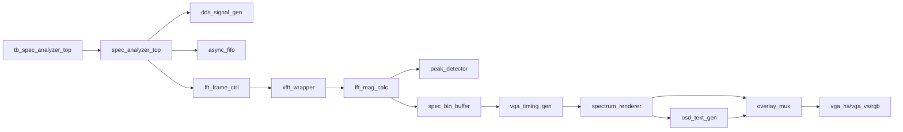

# FPGA 课程大作业工程框架

项目名称：基于 Verilog 的实时频谱分析仪仿真系统

## 1. 项目目标

本项目面向 FPGA 课程大作业，采用 **Verilog + Vivado** 完成一个 **纯仿真** 的实时频谱分析系统。

### 核心目标
- 生成测试信号
- 完成跨时钟域缓存
- 调用 FFT IP 做频谱分析
- 计算频谱幅值与峰值频点
- 用 VGA 时序做频谱柱状图与文字叠加显示

### 纯仿真边界
- 不接外部 ADC
- 不依赖实体按键
- 不依赖串口外设
- 不写板级约束为主目标
- 所有控制通过 testbench / 仿真模型完成

---

## 2. 推荐技术路线

最稳方案：

1. `DDS` 产生正弦 / 方波 / 三角波 / 锯齿波
2. `Async FIFO` 做跨时钟域缓存
3. `Vivado FFT IP` 完成频谱变换
4. `FFT 后处理` 计算幅值、峰值、显示高度
5. `VGA` 扫描生成频谱图层和 OSD 文字

### 为什么这样做
- 符合课程要求
- 工作量可控
- 仿真可验证
- 答辩展示效果强

---

## 3. 系统功能清单

### 必做功能
- 4 种波形输出
- 频率可调
- FFT 频谱分析
- 频谱幅值缓存
- VGA 风格柱状图输出
- 峰值 bin 检测
- 纯仿真验证

### 加分功能
- 双音输入
- 扫频动画
- Hann 窗函数
- 频谱冻结
- 参数文字叠加
- 时域 + 频域双窗口显示

---

## 4. 模块框图



---

## 5. Vivado 工程目录

```text
SpectrumAnalyzer/
├─ README.md
├─ rtl/
│  ├─ top/
│  │  └─ spec_analyzer_top.v
│  ├─ common/
│  │  ├─ clk_rst_gen.v
│  │  ├─ sync_reset.v
│  │  └─ pulse_sync.v
│  ├─ ctrl/
│  │  └─ ctrl_model.v
│  ├─ dds/
│  │  ├─ dds_signal_gen.v
│  │  ├─ phase_acc.v
│  │  ├─ wave_rom_sin.v
│  │  ├─ wave_gen_square.v
│  │  ├─ wave_gen_triangle.v
│  │  └─ wave_gen_sawtooth.v
│  ├─ window/
│  │  ├─ win_mul_optional.v
│  │  └─ hann_rom.v
│  ├─ fifo/
│  │  ├─ async_fifo.v
│  │  ├─ fifo_mem.v
│  │  ├─ fifo_wr_ctrl.v
│  │  ├─ fifo_rd_ctrl.v
│  │  ├─ gray_sync.v
│  │  └─ gray_conv.v
│  ├─ fft/
│  │  ├─ fft_frame_ctrl.v
│  │  ├─ xfft_wrapper.v
│  │  └─ fft_cfg_rom.v
│  ├─ postproc/
│  │  ├─ fft_mag_calc.v
│  │  ├─ mag_compress.v
│  │  ├─ peak_detector.v
│  │  ├─ spec_bin_buffer.v
│  │  └─ bin_to_height.v
│  ├─ vga/
│  │  ├─ vga_timing_gen.v
│  │  ├─ spectrum_renderer.v
│  │  ├─ osd_text_gen.v
│  │  ├─ font_rom_8x16.v
│  │  └─ overlay_mux.v
│  └─ sim_model/
│     └─ frame_dump_model.v
├─ ip/
│  └─ xfft_256/
├─ sim/
│  ├─ tb/
│  │  ├─ tb_spec_analyzer_top.sv
│  │  ├─ tb_fft_chain.sv
│  │  ├─ tb_async_fifo.sv
│  │  └─ tb_vga_render.sv
│  └─ data/
├─ scripts/
│  ├─ create_project.tcl
│  ├─ gen_ip_fft.tcl
│  └─ run_sim.tcl
└─ docs/
   ├─ architecture.md
   ├─ interface_spec.md
   └─ verification_plan.md
```

---

## 6. 顶层接口规划

### `spec_analyzer_top.v`
```verilog
module spec_analyzer_top (
    input  wire        clk_sample,
    input  wire        clk_fft,
    input  wire        clk_pix,
    input  wire        rst_n,

    input  wire [1:0]  mode_wave_sel,
    input  wire [31:0] freq_word,
    input  wire        mode_dual_tone,
    input  wire        mode_window_en,

    output wire        vga_hs,
    output wire        vga_vs,
    output wire [7:0]  vga_r,
    output wire [7:0]  vga_g,
    output wire [7:0]  vga_b,

    output wire [15:0] dbg_peak_bin,
    output wire [31:0] dbg_peak_mag
);
```

---

## 7. 关键模块职责

### DDS
- `phase_acc.v`：相位累加器
- `wave_rom_sin.v`：正弦查表
- `wave_gen_*`：其他波形生成
- `dds_signal_gen.v`：统一波形输出

### FIFO
- `async_fifo.v`：跨时钟域缓存
- `gray_conv.v` / `gray_sync.v`：格雷码与同步
- `fifo_wr_ctrl.v` / `fifo_rd_ctrl.v`：读写指针与满空判断

### FFT
- `fft_frame_ctrl.v`：按帧喂数
- `xfft_wrapper.v`：封装 Vivado FFT IP
- `fft_cfg_rom.v`：配置参数

### 后处理
- `fft_mag_calc.v`：幅值 / 功率计算
- `mag_compress.v`：显示范围压缩
- `peak_detector.v`：峰值 bin 检测
- `spec_bin_buffer.v`：频谱缓存

### VGA
- `vga_timing_gen.v`：行场时序
- `spectrum_renderer.v`：柱状图渲染
- `osd_text_gen.v`：文字叠加
- `overlay_mux.v`：图层合成

---

## 8. 推荐参数

- FFT 点数：`256`
- 输入位宽：`16 bit signed`
- VGA 分辨率：`640x480`
- 像素时钟：`25 MHz`
- FFT 工作时钟：`50 MHz`
- 采样时钟：`10 MHz`

---

## 9. 仿真验证顺序

### 阶段 1：单模块验证
1. `dds_signal_gen`
2. `async_fifo`
3. `vga_timing_gen`

### 阶段 2：链路验证
1. `DDS -> FIFO -> FFT`
2. `FFT -> 幅值 -> 峰值`
3. `频谱缓存 -> VGA 显示`

### 阶段 3：系统验证
1. 单音峰值位置正确
2. 双音峰值出现两个峰
3. 频率切换后频谱变化正确
4. 显示叠加正常

---

## 10. 开发顺序

1. 建工程目录
2. 创建 FFT IP
3. 先写 DDS
4. 再写 FIFO
5. 再写 FFT 控制
6. 再写幅值与峰值
7. 再写 VGA
8. 最后写顶层和 testbench

---

## 11. 答辩高分点

- 使用 `DDS` 保证测试信号可重复
- 使用 `Async FIFO` 体现跨时钟域设计
- 使用 `FFT IP` 完成复杂运算
- 使用幅值压缩和峰值检测增强显示效果
- 使用 VGA 风格输出提升演示直观性

---

## 12. 交付物建议

- RTL 源码
- Vivado 工程
- 仿真 testbench
- 关键波形截图
- 频谱显示截图
- 设计报告

